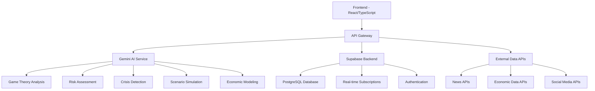

# GeoPolitik - Product Requirements Document (PRD)

## Executive Summary

### Product Vision
To create the world's most advanced interactive platform that combines game theory education with real-time geopolitical prediction capabilities, empowering users to understand and forecast international relations through mathematical modeling and AI-driven insights.

### Product Mission
Enable students, researchers, policymakers, and analysts to master game theory concepts while accessing cutting-edge geopolitical predictions through an intuitive, AI-powered educational platform.

### Success Metrics
- **Educational**: 90% course completion rate, 85% assessment pass rate
- **Prediction**: 75% accuracy on 30-day geopolitical forecasts
- **Engagement**: 60% monthly active user retention
- **Performance**: <2s page load times, 99.9% uptime

---

## Technical Architecture

### System Overview


### Database Schema

#### Core Tables
```sql
-- User Management
CREATE TABLE user_profiles (
    id UUID REFERENCES auth.users PRIMARY KEY,
    role TEXT NOT NULL DEFAULT 'student',
    preferences JSONB DEFAULT '{}',
    created_at TIMESTAMP DEFAULT NOW(),
    updated_at TIMESTAMP DEFAULT NOW()
);

-- Learning System
CREATE TABLE learning_progress (
    id UUID PRIMARY KEY DEFAULT gen_random_uuid(),
    user_id UUID REFERENCES user_profiles(id),
    module_id TEXT NOT NULL,
    completion_percentage INTEGER DEFAULT 0,
    last_accessed TIMESTAMP DEFAULT NOW(),
    performance_data JSONB DEFAULT '{}'
);

-- Risk Assessment
CREATE TABLE risk_assessments (
    id UUID PRIMARY KEY DEFAULT gen_random_uuid(),
    region TEXT NOT NULL,
    risk_score INTEGER NOT NULL,
    factors JSONB NOT NULL,
    confidence_interval JSONB NOT NULL,
    created_at TIMESTAMP DEFAULT NOW(),
    expires_at TIMESTAMP NOT NULL
);

-- Scenario Simulations
CREATE TABLE scenario_simulations (
    id UUID PRIMARY KEY DEFAULT gen_random_uuid(),
    user_id UUID REFERENCES user_profiles(id),
    scenario_config JSONB NOT NULL,
    results JSONB,
    created_at TIMESTAMP DEFAULT NOW()
);

-- Crisis Monitoring
CREATE TABLE crisis_events (
    id UUID PRIMARY KEY DEFAULT gen_random_uuid(),
    title TEXT NOT NULL,
    region TEXT NOT NULL,
    severity TEXT NOT NULL CHECK (severity IN ('low', 'medium', 'high', 'critical')),
    category TEXT NOT NULL,
    description TEXT NOT NULL,
    confidence INTEGER NOT NULL,
    escalation_probability INTEGER NOT NULL,
    sources INTEGER NOT NULL,
    created_at TIMESTAMP DEFAULT NOW()
);

-- Alert System
CREATE TABLE alert_configurations (
    id UUID PRIMARY KEY DEFAULT gen_random_uuid(),
    user_id UUID REFERENCES user_profiles(id),
    alert_type TEXT NOT NULL,
    criteria JSONB NOT NULL,
    notification_settings JSONB NOT NULL,
    is_active BOOLEAN DEFAULT true
);

-- Economic Modeling
CREATE TABLE economic_models (
    id UUID PRIMARY KEY DEFAULT gen_random_uuid(),
    scenario_id TEXT NOT NULL,
    model_type TEXT NOT NULL,
    parameters JSONB NOT NULL,
    results JSONB,
    created_at TIMESTAMP DEFAULT NOW()
);

-- Collaborative Workspace
CREATE TABLE documents (
    id UUID PRIMARY KEY DEFAULT gen_random_uuid(),
    title TEXT NOT NULL,
    content TEXT NOT NULL,
    owner_id UUID REFERENCES auth.users(id),
    shared_with JSONB DEFAULT '[]',
    version INTEGER DEFAULT 1,
    created_at TIMESTAMP DEFAULT NOW(),
    updated_at TIMESTAMP DEFAULT NOW()
);

-- Custom Model Training
CREATE TABLE custom_models (
    id UUID PRIMARY KEY DEFAULT gen_random_uuid(),
    user_id UUID REFERENCES auth.users(id),
    name TEXT NOT NULL,
    description TEXT,
    model_type TEXT NOT NULL,
    parameters JSONB NOT NULL,
    dataset_id UUID,
    status TEXT DEFAULT 'draft',
    metrics JSONB,
    created_at TIMESTAMP DEFAULT NOW(),
    updated_at TIMESTAMP DEFAULT NOW()
);
```

#### Row Level Security (RLS) Policies
```sql
-- Enable RLS on all tables
ALTER TABLE user_profiles ENABLE ROW LEVEL SECURITY;
ALTER TABLE learning_progress ENABLE ROW LEVEL SECURITY;
ALTER TABLE scenario_simulations ENABLE ROW LEVEL SECURITY;
ALTER TABLE alert_configurations ENABLE ROW LEVEL SECURITY;
ALTER TABLE documents ENABLE ROW LEVEL SECURITY;
ALTER TABLE custom_models ENABLE ROW LEVEL SECURITY;

-- User can only access their own data
CREATE POLICY "Users can read own profile" ON user_profiles
    FOR SELECT USING (auth.uid() = id);

CREATE POLICY "Users can update own profile" ON user_profiles
    FOR UPDATE USING (auth.uid() = id);

CREATE POLICY "Users can read own progress" ON learning_progress
    FOR SELECT USING (auth.uid() = user_id);

CREATE POLICY "Users can insert own progress" ON learning_progress
    FOR INSERT WITH CHECK (auth.uid() = user_id);

-- Public read access for risk assessments and crisis events
CREATE POLICY "Public read access" ON risk_assessments
    FOR SELECT TO authenticated USING (true);

CREATE POLICY "Public read access" ON crisis_events
    FOR SELECT TO authenticated USING (true);
```

---

## Core User Stories & Implementation

### User Story 1: Interactive Game Theory Tutorial

**As a** student new to game theory  
**I want to** learn fundamental concepts through AI-powered interactive tutorials  
**So that** I can understand strategic decision-making in geopolitics

#### Implementation Details
- **AI Integration**: Gemini 2.5 Flash generates personalized tutorials
- **Adaptive Learning**: Progress tracking with difficulty adjustment
- **Interactive Elements**: Game trees, payoff matrices, scenario analysis
- **Real-time Feedback**: Immediate assessment and guidance

#### Technical Components
```typescript
// Custom Hook for Game Theory Learning
const useGameTheory = () => {
  const [currentTutorial, setCurrentTutorial] = useState<TutorialContent | null>(null);
  const [userProgress, setUserProgress] = useState<UserProgress>({
    completedModules: [],
    currentScore: 0,
    timeSpent: 0
  });

  const generateTutorial = async (level: string, topic: string) => {
    const tutorial = await geminiService.generateGameTheoryTutorial(level, topic, userProgress);
    setCurrentTutorial(tutorial);
    await dataService.saveLearningProgress(userId, `${level}_${topic}`, tutorial);
  };

  return { currentTutorial, userProgress, generateTutorial };
};
```

### User Story 2: Real-Time Geopolitical Risk Assessment

**As a** policy analyst  
**I want to** receive AI-powered real-time geopolitical risk assessments  
**So that** I can make informed strategic recommendations

#### Implementation Details
- **Live Risk Scoring**: 0-100 scale with confidence intervals
- **Multi-factor Analysis**: Political, economic, military, social factors
- **AI-Powered Insights**: Gemini analyzes multiple data sources
- **Real-time Updates**: Supabase real-time subscriptions

#### Technical Components
```typescript
// Risk Assessment Service
const useRiskAssessment = () => {
  const [assessments, setAssessments] = useState<RiskAssessment[]>([]);
  
  const generateRiskAssessment = async (regions: string[], factors: string[]) => {
    // Fetch latest data
    const [newsData, economicData] = await Promise.all([
      dataService.fetchLatestNews(regions),
      dataService.fetchEconomicIndicators(regions)
    ]);
    
    // AI analysis
    const riskData = await geminiService.generateRiskAssessment(regions, factors);
    
    // Save and cache results
    for (const assessment of riskData.assessments) {
      await dataService.saveRiskAssessment(assessment);
    }
    
    setAssessments(riskData.assessments);
  };

  return { assessments, generateRiskAssessment };
};
```

### User Story 3: Advanced Economic Modeling

**As an** economic analyst  
**I want to** model the economic impact of geopolitical scenarios  
**So that** I can forecast GDP effects, trade flows, and employment impacts

#### Implementation Details
- **GDP Impact Analysis**: Primary, secondary, and total effects with confidence intervals
- **Trade Flow Analysis**: Bilateral and multilateral trade volume changes
- **Employment Effects**: Sector-specific job impact modeling
- **Welfare Impact**: Consumer/producer surplus and government fiscal analysis
- **Timeline Analysis**: Short, medium, and long-term projections

#### Technical Components
```typescript
// Economic Modeling Service
const useEconomicModeling = () => {
  const [economicImpact, setEconomicImpact] = useState<EconomicImpact | null>(null);
  
  const generateEconomicAnalysis = async (scenario: EconomicScenario) => {
    // AI-powered economic analysis
    const impact = await geminiService.generateEconomicImpactAnalysis(scenario);
    
    // Save results
    await dataService.saveEconomicModel(scenario.id, impact);
    
    setEconomicImpact(impact);
  };

  return { economicImpact, generateEconomicAnalysis };
};
```

### User Story 4: Crisis Event Monitoring

**As a** diplomatic attache  
**I want to** receive automated AI-powered alerts about developing crises  
**So that** I can respond quickly to emerging situations

#### Implementation Details
- **Real-time Monitoring**: Continuous news and social media analysis
- **AI Crisis Detection**: Gemini analyzes events for crisis potential
- **Configurable Alerts**: Custom thresholds and notification preferences
- **Browser Notifications**: Real-time alerts with escalation levels

#### Technical Components
```typescript
// Crisis Monitoring Hook
const useCrisisMonitoring = () => {
  const [crisisEvents, setCrisisEvents] = useState<CrisisEvent[]>([]);
  const [alerts, setAlerts] = useState<CrisisEvent[]>([]);
  
  const startMonitoring = async (config: AlertConfig) => {
    // Initial scan
    await scanForCrises(config);
    
    // Set up periodic monitoring
    const interval = setInterval(() => {
      scanForCrises(config);
    }, 5 * 60 * 1000); // Every 5 minutes
  };
  
  const scanForCrises = async (config: AlertConfig) => {
    // Fetch latest news
    const newsData = await dataService.fetchLatestNews(config.regions, config.keywords);
    
    // AI analysis
    const crisisAnalysis = await geminiService.analyzeCrisisEvents(newsData);
    
    // Filter and process events
    const filteredEvents = crisisAnalysis.filter(event => 
      event.severity >= config.severity && config.categories.includes(event.category)
    );
    
    setCrisisEvents(prev => [...filteredEvents, ...prev].slice(0, 50));
    
    // Check for new alerts
    const newAlerts = filteredEvents.filter(event => 
      event.severity === 'critical' || event.escalation_probability > 80
    );
    
    if (newAlerts.length > 0) {
      setAlerts(prev => [...newAlerts, ...prev].slice(0, 20));
      
      // Browser notifications
      if (Notification.permission === 'granted') {
        newAlerts.forEach(alert => {
          new Notification(`Crisis Alert: ${alert.title}`, {
            body: alert.description,
            icon: '/crisis-icon.png'
          });
        });
      }
    }
  };

  return { crisisEvents, alerts, startMonitoring };
};
```

### User Story 5: Advanced Analytics

**As a** research analyst  
**I want to** use natural language queries and ensemble models  
**So that** I can gain deeper insights and more accurate predictions

#### Implementation Details
- **Natural Language Querying**: Ask questions in plain English
- **Automated Report Generation**: Create comprehensive analysis reports
- **Predictive Timeline Analysis**: Generate event timelines with probabilities
- **Ensemble Prediction Methods**: Combine multiple models for better accuracy

#### Technical Components
```typescript
// Advanced Analytics Hook
const useAdvancedAnalytics = () => {
  const [currentResponse, setCurrentResponse] = useState<any>(null);
  
  const processNaturalLanguageQuery = async (query: string) => {
    const response = await geminiService.processNaturalLanguageQuery(query);
    setCurrentResponse(response);
    return response;
  };

  const generateAutomatedReport = async (type: string, data: any, timeframe: string) => {
    const reportData = await geminiService.generateAutomatedReport(type, data, timeframe);
    return reportData;
  };

  const generatePredictiveTimeline = async (scenario: any, timeHorizon: string) => {
    const timeline = await geminiService.generatePredictiveTimeline(scenario, timeHorizon);
    return timeline;
  };

  const generateEnsemblePrediction = async (models: string[], data: any) => {
    const ensemble = await geminiService.generateEnsemblePrediction(models, data);
    setCurrentResponse({
      type: 'ensemble_prediction',
      data: ensemble
    });
    return ensemble;
  };

  return { 
    currentResponse, 
    processNaturalLanguageQuery,
    generateAutomatedReport,
    generatePredictiveTimeline,
    generateEnsemblePrediction
  };
};
```

### User Story 6: Mobile Experience

**As a** field analyst  
**I want to** access the platform on mobile devices with offline capabilities  
**So that** I can use the system in areas with limited connectivity

#### Implementation Details
- **Progressive Web App**: Installable on mobile devices
- **Offline Data**: Cache key data for offline access
- **Push Notifications**: Critical alerts even when app is closed
- **Mobile UI**: Touch-optimized interface and gestures
- **Data Synchronization**: Automatic sync when connection is restored

#### Technical Components
```typescript
// Mobile Features Hook
const useMobileFeatures = () => {
  const [isOnline, setIsOnline] = useState(navigator.onLine);
  const [offlineData, setOfflineData] = useState<OfflineData | null>(null);
  
  useEffect(() => {
    window.addEventListener('online', () => {
      setIsOnline(true);
      syncOfflineData();
    });
    
    window.addEventListener('offline', () => {
      setIsOnline(false);
      loadOfflineData();
    });
    
    // Load offline data on mount
    loadOfflineData();
  }, []);

  const downloadOfflineData = async () => {
    // Cache key data for offline use
    const dataToCache = {
      lastSync: new Date().toISOString(),
      cachedAssessments: [...],
      cachedTutorials: [...],
      userProgress: {...}
    };
    
    localStorage.setItem('offlineData', JSON.stringify(dataToCache));
    setOfflineData(dataToCache);
    
    // Cache key API endpoints and assets
    if ('caches' in window) {
      const cache = await caches.open('geopolitik-offline');
      await cache.addAll([
        '/',
        '/dashboard',
        '/tutorials',
        '/risk-assessment',
        '/crisis-monitoring'
      ]);
    }
  };

  return { 
    isOnline, 
    offlineData, 
    downloadOfflineData,
    syncOfflineData,
    requestNotificationPermission,
    installPWA
  };
};
```

---

## AI Integration Architecture

### Gemini 2.5 Flash Integration

#### Service Architecture
```typescript
class GeminiService {
  private apiKey: string;
  private baseUrl = 'https://generativelanguage.googleapis.com/v1beta/models/gemini-2.5-flash:generateContent';

  async generateContent(prompt: string, config?: GenerationConfig): Promise<string> {
    const request = {
      contents: [{ parts: [{ text: prompt }] }],
      generationConfig: {
        temperature: 0.7,
        topK: 40,
        topP: 0.95,
        maxOutputTokens: 4096,
        ...config
      }
    };

    const response = await fetch(`${this.baseUrl}?key=${this.apiKey}`, {
      method: 'POST',
      headers: { 'Content-Type': 'application/json' },
      body: JSON.stringify(request)
    });

    const data = await response.json();
    return data.candidates[0]?.content?.parts[0]?.text || '';
  }

  // Specialized methods for different use cases
  async generateGameTheoryTutorial(level: string, topic: string, userProgress: any) {
    const prompt = `Generate a ${level} level game theory tutorial on ${topic}...`;
    return this.generateContent(prompt, { temperature: 0.7 });
  }

  async generateRiskAssessment(regions: string[], factors: string[]) {
    const prompt = `Analyze geopolitical risk for regions: ${regions.join(', ')}...`;
    return this.generateContent(prompt, { temperature: 0.3 });
  }

  async generateEconomicImpactAnalysis(scenario: any) {
    const prompt = `Analyze economic impacts of: ${JSON.stringify(scenario)}...`;
    return this.generateContent(prompt, { temperature: 0.1 });
  }

  async processNaturalLanguageQuery(query: string) {
    const prompt = `Analyze this geopolitical query: "${query}"...`;
    return this.generateContent(prompt, { temperature: 0.4 });
  }
}
```

#### Prompt Engineering Strategy

**Game Theory Tutor Prompt Template:**
```
You are an expert Game Theory Tutor AI specialized in teaching strategic decision-making concepts. 

CONTEXT:
- Student Level: {level}
- Topic: {topic}
- Previous Progress: {userProgress}

REQUIREMENTS:
1. Provide clear concept explanation with mathematical foundation
2. Include real geopolitical example with specific countries/situations
3. Create interactive element (scenario, calculation, or game tree)
4. Generate assessment question with multiple choice options

OUTPUT FORMAT:
{
  "concept": "string",
  "explanation": "string", 
  "geopoliticalExample": "string",
  "interactiveElement": {
    "type": "scenario|calculation|game_tree",
    "data": {}
  },
  "assessmentQuestion": {
    "question": "string",
    "options": ["string"],
    "correctAnswer": number
  }
}
```

**Economic Impact Analysis Prompt Template:**
```
You are an Advanced Economic Impact Modeling AI.

ANALYSIS FRAMEWORK:
- Provide GDP impact with confidence intervals (primary, secondary, total effects)
- Calculate trade flow changes (bilateral, multilateral with volume data)
- Model employment effects by sector (manufacturing, services, agriculture)
- Assess welfare calculations (consumer surplus, producer surplus, government)
- Analyze fiscal implications (revenue, expenditure, deficit impact)
- Project timeline analysis (immediate, short-term, medium-term, long-term)

INPUT DATA:
- Scenario: {scenario}

OUTPUT REQUIREMENTS:
{
  "gdpImpact": {
    "primary": { "value": number, "confidence": [number, number] },
    "secondary": { "value": number, "confidence": [number, number] },
    "total": { "value": number, "confidence": [number, number] }
  },
  "tradeFlows": {
    "bilateral": { "change": number, "volume": number, "sectors": ["string"] },
    "multilateral": { "change": number, "volume": number, "affected_countries": number }
  },
  "employmentEffects": {
    "manufacturing": { "jobs": number, "percentage": number },
    "services": { "jobs": number, "percentage": number },
    "agriculture": { "jobs": number, "percentage": number },
    "net": { "jobs": number, "percentage": number }
  },
  "welfareImpact": {
    "consumer": { "surplus": number, "confidence": [number, number] },
    "producer": { "surplus": number, "confidence": [number, number] },
    "government": { "revenue": number, "expenditure": number }
  },
  "fiscalImpact": {
    "revenue": { "change": number, "sources": ["string"] },
    "expenditure": { "change": number, "categories": ["string"] },
    "deficit": { "change": number, "sustainability": "string" }
  },
  "timeline": {
    "immediate": "string",
    "short_term": "string",
    "medium_term": "string",
    "long_term": "string"
  }
}
```

---

## Data Integration Strategy

### External API Integration

#### News Data Sources
```typescript
class NewsDataService {
  async fetchLatestNews(regions: string[], keywords: string[] = []): Promise<NewsArticle[]> {
    const sources = [
      { api: 'NewsAPI', weight: 0.4 },
      { api: 'Reuters', weight: 0.3 },
      { api: 'BBC', weight: 0.2 },
      { api: 'AP', weight: 0.1 }
    ];

    const promises = regions.map(region => 
      Promise.all(sources.map(source => 
        this.fetchFromSource(source.api, region, keywords)
      ))
    );

    const results = await Promise.all(promises);
    return this.aggregateAndScore(results);
  }

  private async fetchFromSource(api: string, region: string, keywords: string[]) {
    switch (api) {
      case 'NewsAPI':
        return this.fetchNewsAPI(region, keywords);
      case 'Reuters':
        return this.fetchReuters(region, keywords);
      default:
        return [];
    }
  }
}
```

#### Economic Data Integration
```typescript
class EconomicDataService {
  async fetchEconomicIndicators(countries: string[]): Promise<EconomicData[]> {
    const indicators = [
      'NY.GDP.MKTP.KD.ZG', // GDP growth
      'FP.CPI.TOTL.ZG',    // Inflation
      'SL.UEM.TOTL.ZS',    // Unemployment
      'BX.KLT.DINV.WD.GD.ZS' // FDI
    ];

    const promises = countries.map(country =>
      Promise.all(indicators.map(indicator =>
        this.fetchWorldBankData(country, indicator)
      ))
    );

    return Promise.all(promises);
  }

  private async fetchWorldBankData(country: string, indicator: string) {
    const url = `https://api.worldbank.org/v2/country/${country}/indicator/${indicator}`;
    const response = await fetch(`${url}?format=json&date=2020:2023`);
    return response.json();
  }
}
```

### Real-time Data Pipeline

#### Supabase Real-time Integration
```typescript
class RealTimeService {
  private supabase = createClient(SUPABASE_URL, SUPABASE_ANON_KEY);

  subscribeToRiskUpdates(callback: (data: RiskAssessment) => void) {
    return this.supabase
      .channel('risk_updates')
      .on('postgres_changes', {
        event: 'INSERT',
        schema: 'public',
        table: 'risk_assessments'
      }, (payload) => {
        callback(payload.new as RiskAssessment);
      })
      .subscribe();
  }

  subscribeToCrisisEvents(callback: (data: CrisisEvent) => void) {
    return this.supabase
      .channel('crisis_events')
      .on('postgres_changes', {
        event: 'INSERT',
        schema: 'public',
        table: 'crisis_events'
      }, (payload) => {
        callback(payload.new as CrisisEvent);
      })
      .subscribe();
  }
}
```

---

## Mobile & PWA Implementation

### Service Worker
```javascript
// Service Worker for GeoPolitik PWA
const CACHE_NAME = 'geopolitik-v1';
const urlsToCache = [
  '/',
  '/static/js/bundle.js',
  '/static/css/main.css',
  '/manifest.json'
];

// Install event
self.addEventListener('install', (event) => {
  event.waitUntil(
    caches.open(CACHE_NAME)
      .then((cache) => {
        return cache.addAll(urlsToCache);
      })
  );
});

// Fetch event
self.addEventListener('fetch', (event) => {
  event.respondWith(
    caches.match(event.request)
      .then((response) => {
        // Return cached version or fetch from network
        return response || fetch(event.request);
      })
  );
});

// Push notification event
self.addEventListener('push', (event) => {
  const options = {
    body: event.data ? event.data.text() : 'New geopolitical alert',
    icon: '/icon-192x192.png',
    badge: '/badge-72x72.png',
    vibrate: [100, 50, 100],
    data: {
      dateOfArrival: Date.now(),
      primaryKey: 1
    },
    actions: [
      {
        action: 'explore',
        title: 'View Details',
        icon: '/icon-explore.png'
      },
      {
        action: 'close',
        title: 'Close',
        icon: '/icon-close.png'
      }
    ]
  };

  event.waitUntil(
    self.registration.showNotification('GeoPolitik Alert', options)
  );
});
```

### Web App Manifest
```json
{
  "name": "GeoPolitik - Game Theory Geopolitical Platform",
  "short_name": "GeoPolitik",
  "description": "Advanced AI-powered platform for game theory education and geopolitical analysis",
  "start_url": "/",
  "display": "standalone",
  "background_color": "#0a0a0a",
  "theme_color": "#3b82f6",
  "orientation": "portrait-primary",
  "icons": [
    {
      "src": "/icon-192x192.png",
      "sizes": "192x192",
      "type": "image/png",
      "purpose": "any maskable"
    },
    {
      "src": "/icon-512x512.png",
      "sizes": "512x512",
      "type": "image/png",
      "purpose": "any maskable"
    }
  ],
  "shortcuts": [
    {
      "name": "Risk Assessment",
      "short_name": "Risk",
      "description": "Quick access to geopolitical risk analysis",
      "url": "/risk-assessment"
    },
    {
      "name": "Crisis Monitor",
      "short_name": "Crisis",
      "description": "Real-time crisis monitoring dashboard",
      "url": "/crisis-monitoring"
    }
  ]
}
```

---

## Supabase Database Schema

The application uses the following key tables in Supabase:

### User Management
```sql
CREATE TABLE user_profiles (
    id UUID REFERENCES auth.users PRIMARY KEY,
    role TEXT NOT NULL DEFAULT 'student',
    preferences JSONB DEFAULT '{}',
    created_at TIMESTAMP DEFAULT NOW(),
    updated_at TIMESTAMP DEFAULT NOW()
);
```

### Learning System
```sql
CREATE TABLE learning_progress (
    id UUID PRIMARY KEY DEFAULT gen_random_uuid(),
    user_id UUID REFERENCES user_profiles(id),
    module_id TEXT NOT NULL,
    completion_percentage INTEGER DEFAULT 0,
    last_accessed TIMESTAMP DEFAULT NOW(),
    performance_data JSONB DEFAULT '{}'
);
```

### Risk Assessment
```sql
CREATE TABLE risk_assessments (
    id UUID PRIMARY KEY DEFAULT gen_random_uuid(),
    region TEXT NOT NULL,
    risk_score INTEGER NOT NULL,
    factors JSONB NOT NULL,
    confidence_interval JSONB NOT NULL,
    created_at TIMESTAMP DEFAULT NOW(),
    expires_at TIMESTAMP NOT NULL
);
```

### Crisis Monitoring
```sql
CREATE TABLE crisis_events (
    id UUID PRIMARY KEY DEFAULT gen_random_uuid(),
    title TEXT NOT NULL,
    region TEXT NOT NULL,
    severity TEXT NOT NULL CHECK (severity IN ('low', 'medium', 'high', 'critical')),
    category TEXT NOT NULL,
    description TEXT NOT NULL,
    confidence INTEGER NOT NULL,
    escalation_probability INTEGER NOT NULL,
    sources INTEGER NOT NULL,
    created_at TIMESTAMP DEFAULT NOW()
);

CREATE TABLE alert_configurations (
    id UUID PRIMARY KEY DEFAULT gen_random_uuid(),
    user_id UUID REFERENCES user_profiles(id),
    alert_type TEXT NOT NULL,
    criteria JSONB NOT NULL,
    notification_settings JSONB NOT NULL,
    is_active BOOLEAN DEFAULT true
);
```

### Scenario Simulation
```sql
CREATE TABLE scenario_simulations (
    id UUID PRIMARY KEY DEFAULT gen_random_uuid(),
    user_id UUID REFERENCES user_profiles(id),
    scenario_config JSONB NOT NULL,
    results JSONB,
    created_at TIMESTAMP DEFAULT NOW()
);
```

### Economic Modeling
```sql
CREATE TABLE economic_models (
    id UUID PRIMARY KEY DEFAULT gen_random_uuid(),
    scenario_id TEXT NOT NULL,
    model_type TEXT NOT NULL,
    parameters JSONB NOT NULL,
    results JSONB,
    created_at TIMESTAMP DEFAULT NOW()
);
```

### Advanced Analytics
```sql
CREATE TABLE nl_queries (
    id UUID PRIMARY KEY DEFAULT gen_random_uuid(),
    user_id UUID REFERENCES user_profiles(id),
    query_text TEXT NOT NULL,
    response_data JSONB NOT NULL,
    created_at TIMESTAMP DEFAULT NOW()
);

CREATE TABLE generated_reports (
    id UUID PRIMARY KEY DEFAULT gen_random_uuid(),
    user_id UUID REFERENCES user_profiles(id),
    report_type TEXT NOT NULL,
    title TEXT NOT NULL,
    content JSONB NOT NULL,
    created_at TIMESTAMP DEFAULT NOW()
);
```

---

## Remaining Features

While most features have been implemented, the following items are still pending for future development:

1. **VR/AR Visualization**
   - Immersive 3D data visualization
   - Virtual reality scenario exploration
   - Augmented reality data overlays

2. **Blockchain Integration**
   - Decentralized prediction markets
   - Immutable analysis records
   - Token-based incentive systems

3. **Quantum Computing Integration**
   - Advanced simulation capabilities
   - Complex multi-variable modeling
   - Quantum-resistant security

4. **Regulatory Compliance Framework**
   - Government certification modules
   - Compliance reporting tools
   - Audit trail functionality

5. **Advanced Natural Language Generation**
   - Automated policy brief generation
   - Multi-language report translation
   - Narrative scenario development

These features are planned for future releases and will further enhance the platform's capabilities.

---

This PRD serves as the foundation for building a world-class geopolitical analysis platform that combines cutting-edge AI technology with proven game theory principles to deliver unprecedented insights into global affairs.