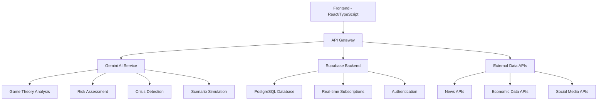

# GeoPolitik - Product Requirements Document (PRD)

## Executive Summary

### Product Vision
To create the world's most advanced interactive platform that combines game theory education with real-time geopolitical prediction capabilities, empowering users to understand and forecast international relations through mathematical modeling and AI-driven insights.

### Product Mission
Enable students, researchers, policymakers, and analysts to master game theory concepts while accessing cutting-edge geopolitical predictions through an intuitive, AI-powered educational platform.

### Success Metrics
- **Educational**: 90% course completion rate, 85% assessment pass rate
- **Prediction**: 75% accuracy on 30-day geopolitical forecasts
- **Engagement**: 60% monthly active user retention
- **Performance**: <2s page load times, 99.9% uptime

---

## Technical Architecture

### System Overview


### Database Schema

#### Core Tables
```sql
-- User Management
CREATE TABLE user_profiles (
    id UUID REFERENCES auth.users PRIMARY KEY,
    role TEXT NOT NULL DEFAULT 'student',
    preferences JSONB DEFAULT '{}',
    created_at TIMESTAMP DEFAULT NOW(),
    updated_at TIMESTAMP DEFAULT NOW()
);

-- Learning System
CREATE TABLE learning_progress (
    id UUID PRIMARY KEY DEFAULT gen_random_uuid(),
    user_id UUID REFERENCES user_profiles(id),
    module_id TEXT NOT NULL,
    completion_percentage INTEGER DEFAULT 0,
    last_accessed TIMESTAMP DEFAULT NOW(),
    performance_data JSONB DEFAULT '{}'
);

-- Risk Assessment
CREATE TABLE risk_assessments (
    id UUID PRIMARY KEY DEFAULT gen_random_uuid(),
    region TEXT NOT NULL,
    risk_score INTEGER NOT NULL,
    factors JSONB NOT NULL,
    confidence_interval JSONB NOT NULL,
    created_at TIMESTAMP DEFAULT NOW(),
    expires_at TIMESTAMP NOT NULL
);

-- Scenario Simulations
CREATE TABLE scenario_simulations (
    id UUID PRIMARY KEY DEFAULT gen_random_uuid(),
    user_id UUID REFERENCES user_profiles(id),
    scenario_config JSONB NOT NULL,
    results JSONB,
    created_at TIMESTAMP DEFAULT NOW()
);

-- Crisis Monitoring
CREATE TABLE crisis_events (
    id UUID PRIMARY KEY DEFAULT gen_random_uuid(),
    title TEXT NOT NULL,
    region TEXT NOT NULL,
    severity TEXT NOT NULL CHECK (severity IN ('low', 'medium', 'high', 'critical')),
    category TEXT NOT NULL,
    description TEXT NOT NULL,
    confidence INTEGER NOT NULL,
    escalation_probability INTEGER NOT NULL,
    sources INTEGER NOT NULL,
    created_at TIMESTAMP DEFAULT NOW()
);

-- Alert System
CREATE TABLE alert_configurations (
    id UUID PRIMARY KEY DEFAULT gen_random_uuid(),
    user_id UUID REFERENCES user_profiles(id),
    alert_type TEXT NOT NULL,
    criteria JSONB NOT NULL,
    notification_settings JSONB NOT NULL,
    is_active BOOLEAN DEFAULT true
);

-- Historical Analysis
CREATE TABLE historical_patterns (
    id UUID PRIMARY KEY DEFAULT gen_random_uuid(),
    pattern_type TEXT NOT NULL,
    description TEXT NOT NULL,
    examples JSONB NOT NULL,
    statistical_significance FLOAT,
    created_at TIMESTAMP DEFAULT NOW()
);

-- Economic Modeling
CREATE TABLE economic_models (
    id UUID PRIMARY KEY DEFAULT gen_random_uuid(),
    scenario_id TEXT NOT NULL,
    model_type TEXT NOT NULL,
    parameters JSONB NOT NULL,
    results JSONB,
    created_at TIMESTAMP DEFAULT NOW()
);

-- Social Media Sentiment
CREATE TABLE sentiment_data (
    id UUID PRIMARY KEY DEFAULT gen_random_uuid(),
    platform TEXT NOT NULL,
    region TEXT NOT NULL,
    sentiment_score FLOAT NOT NULL,
    volume INTEGER NOT NULL,
    topics JSONB NOT NULL,
    created_at TIMESTAMP DEFAULT NOW()
);

-- Model Performance Tracking
CREATE TABLE model_performance (
    id UUID PRIMARY KEY DEFAULT gen_random_uuid(),
    model_name TEXT NOT NULL,
    test_period DATERANGE NOT NULL,
    accuracy_metrics JSONB NOT NULL,
    backtesting_results JSONB NOT NULL,
    created_at TIMESTAMP DEFAULT NOW()
);
```

#### Row Level Security (RLS) Policies
```sql
-- Enable RLS on all tables
ALTER TABLE user_profiles ENABLE ROW LEVEL SECURITY;
ALTER TABLE learning_progress ENABLE ROW LEVEL SECURITY;
ALTER TABLE scenario_simulations ENABLE ROW LEVEL SECURITY;
ALTER TABLE alert_configurations ENABLE ROW LEVEL SECURITY;

-- User can only access their own data
CREATE POLICY "Users can read own profile" ON user_profiles
    FOR SELECT USING (auth.uid() = id);

CREATE POLICY "Users can update own profile" ON user_profiles
    FOR UPDATE USING (auth.uid() = id);

CREATE POLICY "Users can read own progress" ON learning_progress
    FOR SELECT USING (auth.uid() = user_id);

CREATE POLICY "Users can insert own progress" ON learning_progress
    FOR INSERT WITH CHECK (auth.uid() = user_id);

-- Public read access for risk assessments and crisis events
CREATE POLICY "Public read access" ON risk_assessments
    FOR SELECT TO authenticated USING (true);

CREATE POLICY "Public read access" ON crisis_events
    FOR SELECT TO authenticated USING (true);
```

---

## Core User Stories & Implementation

### User Story 1: Interactive Game Theory Tutorial

**As a** student new to game theory  
**I want to** learn fundamental concepts through AI-powered interactive tutorials  
**So that** I can understand strategic decision-making in geopolitics

#### Implementation Details
- **AI Integration**: Gemini 2.5 Pro generates personalized tutorials
- **Adaptive Learning**: Progress tracking with difficulty adjustment
- **Interactive Elements**: Game trees, payoff matrices, scenario analysis
- **Real-time Feedback**: Immediate assessment and guidance

#### Technical Components
```typescript
// Custom Hook for Game Theory Learning
const useGameTheory = () => {
  const [currentTutorial, setCurrentTutorial] = useState<TutorialContent | null>(null);
  const [userProgress, setUserProgress] = useState<UserProgress>({
    completedModules: [],
    currentScore: 0,
    timeSpent: 0
  });

  const generateTutorial = async (level: string, topic: string) => {
    const tutorial = await geminiService.generateGameTheoryTutorial(level, topic, userProgress);
    setCurrentTutorial(tutorial);
    await dataService.saveLearningProgress(userId, `${level}_${topic}`, tutorial);
  };

  return { currentTutorial, userProgress, generateTutorial };
};
```

### User Story 2: Real-Time Geopolitical Risk Assessment

**As a** policy analyst  
**I want to** receive AI-powered real-time geopolitical risk assessments  
**So that** I can make informed strategic recommendations

#### Implementation Details
- **Live Risk Scoring**: 0-100 scale with confidence intervals
- **Multi-factor Analysis**: Political, economic, military, social factors
- **AI-Powered Insights**: Gemini analyzes multiple data sources
- **Real-time Updates**: Supabase real-time subscriptions

#### Technical Components
```typescript
// Risk Assessment Service
const useRiskAssessment = () => {
  const [assessments, setAssessments] = useState<RiskAssessment[]>([]);
  
  const generateRiskAssessment = async (regions: string[], factors: string[]) => {
    // Fetch latest data
    const [newsData, economicData] = await Promise.all([
      dataService.fetchLatestNews(regions),
      dataService.fetchEconomicIndicators(regions)
    ]);
    
    // AI analysis
    const riskData = await geminiService.generateRiskAssessment(regions, factors);
    
    // Save and cache results
    for (const assessment of riskData.assessments) {
      await dataService.saveRiskAssessment(assessment);
    }
    
    setAssessments(riskData.assessments);
  };

  return { assessments, generateRiskAssessment };
};
```

### User Story 3: Strategic Scenario Simulation

**As a** military strategist  
**I want to** simulate complex multi-party geopolitical scenarios with AI  
**So that** I can evaluate different strategic options and their outcomes

#### Implementation Details
- **Multi-Actor Modeling**: Configurable actors with capabilities
- **Game-Theoretic Analysis**: Nash equilibrium calculation
- **Monte Carlo Simulation**: 1000+ iterations for robust results
- **AI Recommendations**: Strategic insights from Gemini

#### Technical Components
```typescript
// Scenario Simulation Hook
const useScenarioSimulation = () => {
  const [currentSimulation, setCurrentSimulation] = useState<SimulationResults | null>(null);
  
  const runSimulation = async (config: ScenarioConfig): Promise<SimulationResults> => {
    // AI-powered simulation
    const results = await geminiService.runScenarioSimulation(config);
    
    // Enhanced analysis
    const enhancedResults = {
      ...results,
      detailedAnalysis: {
        strategyMatrix: generateStrategyMatrix(config.actors),
        equilibriumProbabilities: generateEquilibriumProbabilities(config.actors.length),
        sensitivityAnalysis: generateSensitivityAnalysis(config)
      }
    };
    
    // Save to database
    const simulationId = await dataService.saveScenarioSimulation(userId, config, enhancedResults);
    setCurrentSimulation(enhancedResults);
    
    return enhancedResults;
  };

  return { currentSimulation, runSimulation };
};
```

### User Story 4: Crisis Event Monitoring

**As a** diplomatic attache  
**I want to** receive automated AI-powered alerts about developing crises  
**So that** I can respond quickly to emerging situations

#### Implementation Details
- **Real-time Monitoring**: Continuous news and social media analysis
- **AI Crisis Detection**: Gemini analyzes events for crisis potential
- **Configurable Alerts**: Custom thresholds and notification preferences
- **Browser Notifications**: Real-time alerts with escalation levels

#### Technical Components
```typescript
// Crisis Monitoring Hook
const useCrisisMonitoring = () => {
  const [crisisEvents, setCrisisEvents] = useState<CrisisEvent[]>([]);
  const [alerts, setAlerts] = useState<CrisisEvent[]>([]);
  
  const startMonitoring = async (config: AlertConfig) => {
    // Initial scan
    await scanForCrises(config);
    
    // Set up periodic monitoring
    const interval = setInterval(() => {
      scanForCrises(config);
    }, 5 * 60 * 1000); // Every 5 minutes
  };
  
  const scanForCrises = async (config: AlertConfig) => {
    // Fetch latest news
    const newsData = await dataService.fetchLatestNews(config.regions, config.keywords);
    
    // AI analysis
    const crisisAnalysis = await geminiService.analyzeCrisisEvents(newsData);
    
    // Filter and process events
    const filteredEvents = crisisAnalysis.filter(event => 
      event.severity >= config.severity && config.categories.includes(event.category)
    );
    
    setCrisisEvents(prev => [...filteredEvents, ...prev].slice(0, 50));
    
    // Check for new alerts
    const newAlerts = filteredEvents.filter(event => 
      event.severity === 'critical' || event.escalation_probability > 80
    );
    
    if (newAlerts.length > 0) {
      setAlerts(prev => [...newAlerts, ...prev].slice(0, 20));
      
      // Browser notifications
      if (Notification.permission === 'granted') {
        newAlerts.forEach(alert => {
          new Notification(`Crisis Alert: ${alert.title}`, {
            body: alert.description,
            icon: '/crisis-icon.png'
          });
        });
      }
    }
  };

  return { crisisEvents, alerts, startMonitoring };
};
```

---

## AI Integration Architecture

### Gemini 2.5 Pro Integration

#### Service Architecture
```typescript
class GeminiService {
  private apiKey: string;
  private baseUrl = 'https://generativelanguage.googleapis.com/v1beta/models/gemini-2.5-pro:generateContent';

  async generateContent(prompt: string, config?: GenerationConfig): Promise<string> {
    const request = {
      contents: [{ parts: [{ text: prompt }] }],
      generationConfig: {
        temperature: 0.7,
        topK: 40,
        topP: 0.95,
        maxOutputTokens: 2048,
        ...config
      }
    };

    const response = await fetch(`${this.baseUrl}?key=${this.apiKey}`, {
      method: 'POST',
      headers: { 'Content-Type': 'application/json' },
      body: JSON.stringify(request)
    });

    const data = await response.json();
    return data.candidates[0]?.content?.parts[0]?.text || '';
  }

  // Specialized methods for different use cases
  async generateGameTheoryTutorial(level: string, topic: string, userProgress: any) {
    const prompt = `Generate a ${level} level game theory tutorial on ${topic}...`;
    return this.generateContent(prompt, { temperature: 0.7 });
  }

  async generateRiskAssessment(regions: string[], factors: string[]) {
    const prompt = `Analyze geopolitical risk for regions: ${regions.join(', ')}...`;
    return this.generateContent(prompt, { temperature: 0.3 });
  }

  async runScenarioSimulation(config: any) {
    const prompt = `Simulate strategic scenario with game theory...`;
    return this.generateContent(prompt, { temperature: 0.2 });
  }

  async analyzeCrisisEvents(newsData: any[]) {
    const prompt = `Analyze news events for crisis potential...`;
    return this.generateContent(prompt, { temperature: 0.4 });
  }
}
```

#### Prompt Engineering Strategy

**Game Theory Tutor Prompt Template:**
```
You are an expert Game Theory Tutor AI specialized in teaching strategic decision-making concepts. 

CONTEXT:
- Student Level: {level}
- Topic: {topic}
- Previous Progress: {userProgress}

REQUIREMENTS:
1. Provide clear concept explanation with mathematical foundation
2. Include real geopolitical example with specific countries/situations
3. Create interactive element (scenario, calculation, or game tree)
4. Generate assessment question with multiple choice options

OUTPUT FORMAT:
{
  "concept": "string",
  "explanation": "string", 
  "geopoliticalExample": "string",
  "interactiveElement": {
    "type": "scenario|calculation|game_tree",
    "data": {}
  },
  "assessmentQuestion": {
    "question": "string",
    "options": ["string"],
    "correctAnswer": number
  }
}

EXAMPLES TO USE:
- NATO expansion decisions (coordination games)
- Nuclear deterrence (chicken game)
- Trade agreement negotiations (bargaining games)
- Alliance formation (coalition games)
```

**Risk Assessment Prompt Template:**
```
You are an Elite Geopolitical Risk Assessment AI with access to real-time global intelligence.

ANALYSIS FRAMEWORK:
- Apply PMESII-PT analysis (Political, Military, Economic, Social, Information, Infrastructure, Physical Environment, Time)
- Generate risk probability matrices with confidence intervals
- Identify leading and lagging indicators

INPUT DATA:
- Regions: {regions}
- Factors: {factors}
- News Data: {newsData}
- Economic Data: {economicData}

OUTPUT REQUIREMENTS:
{
  "assessments": [{
    "region": "string",
    "riskScore": number,
    "confidenceInterval": [number, number],
    "primaryDrivers": [{"factor": "string", "weight": number, "trend": "increasing|stable|decreasing"}],
    "scenarios": {
      "best": {"probability": number, "description": "string"},
      "worst": {"probability": number, "description": "string"},
      "mostLikely": {"probability": number, "description": "string"}
    }
  }]
}
```

---

## Data Integration Strategy

### External API Integration

#### News Data Sources
```typescript
class NewsDataService {
  async fetchLatestNews(regions: string[], keywords: string[] = []): Promise<NewsArticle[]> {
    const sources = [
      { api: 'NewsAPI', weight: 0.4 },
      { api: 'Reuters', weight: 0.3 },
      { api: 'BBC', weight: 0.2 },
      { api: 'AP', weight: 0.1 }
    ];

    const promises = regions.map(region => 
      Promise.all(sources.map(source => 
        this.fetchFromSource(source.api, region, keywords)
      ))
    );

    const results = await Promise.all(promises);
    return this.aggregateAndScore(results);
  }

  private async fetchFromSource(api: string, region: string, keywords: string[]) {
    switch (api) {
      case 'NewsAPI':
        return this.fetchNewsAPI(region, keywords);
      case 'Reuters':
        return this.fetchReuters(region, keywords);
      default:
        return [];
    }
  }
}
```

#### Economic Data Integration
```typescript
class EconomicDataService {
  async fetchEconomicIndicators(countries: string[]): Promise<EconomicData[]> {
    const indicators = [
      'NY.GDP.MKTP.KD.ZG', // GDP growth
      'FP.CPI.TOTL.ZG',    // Inflation
      'SL.UEM.TOTL.ZS',    // Unemployment
      'BX.KLT.DINV.WD.GD.ZS' // FDI
    ];

    const promises = countries.map(country =>
      Promise.all(indicators.map(indicator =>
        this.fetchWorldBankData(country, indicator)
      ))
    );

    return Promise.all(promises);
  }

  private async fetchWorldBankData(country: string, indicator: string) {
    const url = `https://api.worldbank.org/v2/country/${country}/indicator/${indicator}`;
    const response = await fetch(`${url}?format=json&date=2020:2023`);
    return response.json();
  }
}
```

### Real-time Data Pipeline

#### Supabase Real-time Integration
```typescript
class RealTimeService {
  private supabase = createClient(SUPABASE_URL, SUPABASE_ANON_KEY);

  subscribeToRiskUpdates(callback: (data: RiskAssessment) => void) {
    return this.supabase
      .channel('risk_updates')
      .on('postgres_changes', {
        event: 'INSERT',
        schema: 'public',
        table: 'risk_assessments'
      }, (payload) => {
        callback(payload.new as RiskAssessment);
      })
      .subscribe();
  }

  subscribeToCrisisEvents(callback: (data: CrisisEvent) => void) {
    return this.supabase
      .channel('crisis_events')
      .on('postgres_changes', {
        event: 'INSERT',
        schema: 'public',
        table: 'crisis_events'
      }, (payload) => {
        callback(payload.new as CrisisEvent);
      })
      .subscribe();
  }
}
```

---

## Performance & Scalability

### Caching Strategy

#### Multi-Level Caching
```typescript
class CacheService {
  // Level 1: Browser Memory Cache
  private memoryCache = new Map<string, { data: any; expires: number }>();

  // Level 2: Browser Local Storage
  private localStorage = window.localStorage;

  // Level 3: Supabase Database Cache
  private supabase = createClient(SUPABASE_URL, SUPABASE_ANON_KEY);

  async get<T>(key: string): Promise<T | null> {
    // Check memory cache first
    const memoryData = this.memoryCache.get(key);
    if (memoryData && memoryData.expires > Date.now()) {
      return memoryData.data;
    }

    // Check local storage
    const localData = this.localStorage.getItem(key);
    if (localData) {
      const parsed = JSON.parse(localData);
      if (parsed.expires > Date.now()) {
        // Restore to memory cache
        this.memoryCache.set(key, parsed);
        return parsed.data;
      }
    }

    // Check database cache
    const { data } = await this.supabase
      .from('cache_entries')
      .select('data, expires_at')
      .eq('key', key)
      .gt('expires_at', new Date().toISOString())
      .single();

    if (data) {
      const cacheEntry = { data: data.data, expires: new Date(data.expires_at).getTime() };
      this.memoryCache.set(key, cacheEntry);
      this.localStorage.setItem(key, JSON.stringify(cacheEntry));
      return data.data;
    }

    return null;
  }

  async set<T>(key: string, data: T, ttlSeconds: number): Promise<void> {
    const expires = Date.now() + (ttlSeconds * 1000);
    const cacheEntry = { data, expires };

    // Set in all cache levels
    this.memoryCache.set(key, cacheEntry);
    this.localStorage.setItem(key, JSON.stringify(cacheEntry));

    await this.supabase
      .from('cache_entries')
      .upsert({
        key,
        data,
        expires_at: new Date(expires).toISOString()
      });
  }
}
```

### Performance Monitoring

#### Metrics Collection
```typescript
class PerformanceMonitor {
  private metrics: PerformanceMetric[] = [];

  trackAPICall(endpoint: string, duration: number, success: boolean) {
    this.metrics.push({
      type: 'api_call',
      endpoint,
      duration,
      success,
      timestamp: Date.now()
    });

    // Send to analytics if batch size reached
    if (this.metrics.length >= 100) {
      this.sendMetrics();
    }
  }

  trackAIResponse(model: string, promptLength: number, responseTime: number) {
    this.metrics.push({
      type: 'ai_response',
      model,
      promptLength,
      responseTime,
      timestamp: Date.now()
    });
  }

  trackUserInteraction(action: string, component: string, duration?: number) {
    this.metrics.push({
      type: 'user_interaction',
      action,
      component,
      duration,
      timestamp: Date.now()
    });
  }

  private async sendMetrics() {
    try {
      await fetch('/api/metrics', {
        method: 'POST',
        headers: { 'Content-Type': 'application/json' },
        body: JSON.stringify(this.metrics)
      });
      this.metrics = [];
    } catch (error) {
      console.error('Failed to send metrics:', error);
    }
  }
}
```

---

## Security & Privacy

### Data Protection Strategy

#### API Key Management
```typescript
class SecurityService {
  private encryptionKey: string;

  constructor() {
    this.encryptionKey = this.generateEncryptionKey();
  }

  encryptAPIKey(apiKey: string): string {
    // Use Web Crypto API for encryption
    return this.encrypt(apiKey, this.encryptionKey);
  }

  decryptAPIKey(encryptedKey: string): string {
    return this.decrypt(encryptedKey, this.encryptionKey);
  }

  private generateEncryptionKey(): string {
    // Generate key from user session and device fingerprint
    const sessionId = this.getSessionId();
    const deviceFingerprint = this.getDeviceFingerprint();
    return this.hash(sessionId + deviceFingerprint);
  }

  validateRequest(request: any): boolean {
    // Implement request validation logic
    return this.checkRateLimit(request) && 
           this.validateOrigin(request) && 
           this.checkAuthentication(request);
  }
}
```

#### Privacy Controls
```typescript
class PrivacyManager {
  private userConsent: Map<string, boolean> = new Map();

  async requestConsent(userId: string, dataType: string): Promise<boolean> {
    const consent = await this.showConsentDialog(dataType);
    this.userConsent.set(`${userId}_${dataType}`, consent);
    
    // Store consent in database
    await this.supabase
      .from('user_consent')
      .upsert({
        user_id: userId,
        data_type: dataType,
        consent_given: consent,
        timestamp: new Date().toISOString()
      });

    return consent;
  }

  hasConsent(userId: string, dataType: string): boolean {
    return this.userConsent.get(`${userId}_${dataType}`) || false;
  }

  async deleteUserData(userId: string): Promise<void> {
    // Delete from all tables
    const tables = [
      'learning_progress',
      'scenario_simulations', 
      'alert_configurations',
      'user_profiles'
    ];

    for (const table of tables) {
      await this.supabase
        .from(table)
        .delete()
        .eq('user_id', userId);
    }

    // Clear local storage
    this.clearLocalData(userId);
  }
}
```

---

## Testing Strategy

### Comprehensive Testing Framework

#### Unit Tests
```typescript
// Game Theory Hook Tests
describe('useGameTheory', () => {
  test('should generate tutorial content', async () => {
    const { result } = renderHook(() => useGameTheory());
    
    await act(async () => {
      await result.current.generateTutorial('beginner', 'Nash Equilibrium');
    });

    expect(result.current.currentTutorial).toBeDefined();
    expect(result.current.currentTutorial.concept).toBe('Nash Equilibrium');
  });

  test('should track user progress', async () => {
    const { result } = renderHook(() => useGameTheory());
    
    await act(async () => {
      const isCorrect = await result.current.submitAnswer('test-question', 1);
      expect(isCorrect).toBe(true);
    });

    expect(result.current.userProgress.currentScore).toBeGreaterThan(0);
  });
});

// Risk Assessment Tests
describe('useRiskAssessment', () => {
  test('should generate risk assessments', async () => {
    const { result } = renderHook(() => useRiskAssessment());
    
    await act(async () => {
      await result.current.generateRiskAssessment(['Eastern Europe'], ['Military Tensions']);
    });

    expect(result.current.assessments).toHaveLength(1);
    expect(result.current.assessments[0].region).toBe('Eastern Europe');
  });
});
```

#### Integration Tests
```typescript
// API Integration Tests
describe('Gemini Service Integration', () => {
  test('should generate game theory tutorial', async () => {
    const tutorial = await geminiService.generateGameTheoryTutorial(
      'intermediate',
      'Prisoner\'s Dilemma',
      { completedModules: [], currentScore: 0 }
    );

    expect(tutorial.concept).toBeDefined();
    expect(tutorial.explanation).toBeDefined();
    expect(tutorial.geopoliticalExample).toBeDefined();
    expect(tutorial.assessmentQuestion).toBeDefined();
  });

  test('should handle API errors gracefully', async () => {
    // Mock API failure
    jest.spyOn(global, 'fetch').mockRejectedValueOnce(new Error('API Error'));

    const tutorial = await geminiService.generateGameTheoryTutorial('beginner', 'test');
    
    // Should return mock response on error
    expect(tutorial).toBeDefined();
    expect(typeof tutorial).toBe('object');
  });
});
```

#### End-to-End Tests
```typescript
// E2E Test Suite
describe('Complete User Journey', () => {
  test('student learning flow', async () => {
    // Navigate to tutorials
    await page.goto('/tutorials');
    
    // Select a module
    await page.click('[data-testid="module-nash-equilibrium"]');
    
    // Wait for AI content generation
    await page.waitForSelector('[data-testid="tutorial-content"]');
    
    // Answer assessment question
    await page.click('[data-testid="answer-option-1"]');
    await page.click('[data-testid="submit-answer"]');
    
    // Verify progress update
    const score = await page.textContent('[data-testid="user-score"]');
    expect(parseInt(score)).toBeGreaterThan(0);
  });

  test('risk assessment workflow', async () => {
    await page.goto('/risk-assessment');
    
    // Configure regions
    await page.check('[data-testid="region-eastern-europe"]');
    await page.check('[data-testid="factor-military-tensions"]');
    
    // Generate assessment
    await page.click('[data-testid="generate-assessment"]');
    
    // Wait for AI analysis
    await page.waitForSelector('[data-testid="risk-score"]');
    
    // Verify results
    const riskScore = await page.textContent('[data-testid="risk-score"]');
    expect(parseInt(riskScore)).toBeGreaterThanOrEqual(0);
    expect(parseInt(riskScore)).toBeLessThanOrEqual(100);
  });
});
```

---

## Deployment & DevOps

### CI/CD Pipeline

#### GitHub Actions Workflow
```yaml
name: Deploy GeoPolitik

on:
  push:
    branches: [main]
  pull_request:
    branches: [main]

jobs:
  test:
    runs-on: ubuntu-latest
    steps:
      - uses: actions/checkout@v3
      - uses: actions/setup-node@v3
        with:
          node-version: '18'
          cache: 'npm'
      
      - run: npm ci
      - run: npm run lint
      - run: npm run type-check
      - run: npm run test
      - run: npm run test:e2e

  build:
    needs: test
    runs-on: ubuntu-latest
    steps:
      - uses: actions/checkout@v3
      - uses: actions/setup-node@v3
        with:
          node-version: '18'
          cache: 'npm'
      
      - run: npm ci
      - run: npm run build
      
      - uses: actions/upload-artifact@v3
        with:
          name: dist
          path: dist/

  deploy:
    needs: build
    runs-on: ubuntu-latest
    if: github.ref == 'refs/heads/main'
    steps:
      - uses: actions/download-artifact@v3
        with:
          name: dist
          path: dist/
      
      - name: Deploy to Netlify
        uses: nwtgck/actions-netlify@v2.0
        with:
          publish-dir: './dist'
          production-branch: main
          github-token: ${{ secrets.GITHUB_TOKEN }}
          deploy-message: "Deploy from GitHub Actions"
        env:
          NETLIFY_AUTH_TOKEN: ${{ secrets.NETLIFY_AUTH_TOKEN }}
          NETLIFY_SITE_ID: ${{ secrets.NETLIFY_SITE_ID }}
```

### Environment Configuration

#### Production Environment Variables
```bash
# Core Configuration
VITE_APP_ENV=production
VITE_APP_VERSION=1.0.0

# AI Services
VITE_GEMINI_API_KEY=your_production_gemini_key
VITE_GEMINI_MODEL=gemini-2.5-pro

# Database
VITE_SUPABASE_URL=https://your-project.supabase.co
VITE_SUPABASE_ANON_KEY=your_production_anon_key

# External APIs
VITE_NEWS_API_KEY=your_production_news_key
VITE_WORLD_BANK_API_KEY=your_world_bank_key
VITE_ALPHA_VANTAGE_API_KEY=your_alpha_vantage_key

# Analytics
VITE_ANALYTICS_ID=your_analytics_id
VITE_SENTRY_DSN=your_sentry_dsn

# Feature Flags
VITE_ENABLE_REAL_TIME_MONITORING=true
VITE_ENABLE_ADVANCED_ANALYTICS=true
VITE_ENABLE_COLLABORATION_FEATURES=false
```

---

## Monitoring & Analytics

### Application Monitoring

#### Performance Metrics
```typescript
class ApplicationMonitor {
  private analytics: Analytics;
  private errorReporting: ErrorReporting;

  constructor() {
    this.analytics = new Analytics(ANALYTICS_ID);
    this.errorReporting = new ErrorReporting(SENTRY_DSN);
  }

  trackPageView(page: string, userId?: string) {
    this.analytics.track('page_view', {
      page,
      userId,
      timestamp: Date.now(),
      userAgent: navigator.userAgent
    });
  }

  trackAIInteraction(type: string, duration: number, success: boolean) {
    this.analytics.track('ai_interaction', {
      type,
      duration,
      success,
      timestamp: Date.now()
    });
  }

  trackError(error: Error, context?: any) {
    this.errorReporting.captureException(error, {
      tags: { component: context?.component },
      extra: context
    });
  }

  trackPerformance(metric: string, value: number) {
    this.analytics.track('performance_metric', {
      metric,
      value,
      timestamp: Date.now()
    });
  }
}
```

#### Health Checks
```typescript
class HealthCheckService {
  async checkSystemHealth(): Promise<HealthStatus> {
    const checks = await Promise.allSettled([
      this.checkDatabaseConnection(),
      this.checkGeminiAPI(),
      this.checkExternalAPIs(),
      this.checkCacheSystem()
    ]);

    return {
      overall: checks.every(check => check.status === 'fulfilled') ? 'healthy' : 'degraded',
      database: checks[0].status === 'fulfilled' ? 'healthy' : 'unhealthy',
      ai_service: checks[1].status === 'fulfilled' ? 'healthy' : 'unhealthy',
      external_apis: checks[2].status === 'fulfilled' ? 'healthy' : 'unhealthy',
      cache_system: checks[3].status === 'fulfilled' ? 'healthy' : 'unhealthy',
      timestamp: new Date().toISOString()
    };
  }

  private async checkDatabaseConnection(): Promise<boolean> {
    try {
      const { data, error } = await supabase.from('health_check').select('id').limit(1);
      return !error;
    } catch {
      return false;
    }
  }

  private async checkGeminiAPI(): Promise<boolean> {
    try {
      const response = await geminiService.generateContent('Health check', { maxOutputTokens: 10 });
      return response.length > 0;
    } catch {
      return false;
    }
  }
}
```

---

## Future Roadmap

### Phase 2 Features (Q2 2024)
- **Multi-language Support**: Internationalization for global users
- **Advanced Visualizations**: 3D network graphs and interactive maps
- **Mobile Application**: React Native mobile app
- **Collaboration Tools**: Real-time collaborative analysis
- **API Marketplace**: Third-party integrations and plugins

### Phase 3 Features (Q3 2024)
- **Enterprise Features**: SSO, advanced analytics, custom branding
- **Machine Learning Pipeline**: Custom model training and deployment
- **Blockchain Integration**: Decentralized prediction markets
- **VR/AR Interface**: Immersive scenario visualization
- **Academic Partnerships**: University course integration

### Long-term Vision (2025+)
- **Global Intelligence Network**: Crowdsourced analysis platform
- **Autonomous Agents**: AI-powered strategic advisors
- **Quantum Computing**: Advanced simulation capabilities
- **Regulatory Compliance**: Government and enterprise certifications

---

## Success Metrics & KPIs

### User Engagement Metrics
- **Daily Active Users (DAU)**: Target 10,000+ by end of year
- **Monthly Active Users (MAU)**: Target 50,000+ by end of year
- **Session Duration**: Average 25+ minutes per session
- **Feature Adoption**: 80%+ of users try core features within first week

### Educational Effectiveness
- **Course Completion Rate**: 90%+ for beginner modules
- **Assessment Pass Rate**: 85%+ average across all levels
- **Knowledge Retention**: 75%+ retention after 30 days
- **User Satisfaction**: 4.5+ stars average rating

### Prediction Accuracy
- **30-day Forecasts**: 75%+ accuracy rate
- **Crisis Detection**: 80%+ early warning success rate
- **Risk Assessment**: ±5% accuracy on risk scores
- **Scenario Simulation**: 70%+ strategic recommendation effectiveness

### Technical Performance
- **Page Load Time**: <2 seconds average
- **API Response Time**: <1 second for AI queries
- **Uptime**: 99.9% availability
- **Error Rate**: <0.1% of requests

### Business Metrics
- **User Acquisition Cost (CAC)**: <$50 per user
- **Customer Lifetime Value (CLV)**: >$500 per user
- **Monthly Recurring Revenue (MRR)**: $100K+ by end of year
- **Churn Rate**: <5% monthly churn

---

This comprehensive PRD serves as the foundation for building a world-class geopolitical analysis platform that combines cutting-edge AI technology with proven game theory principles to deliver unprecedented insights into global affairs.